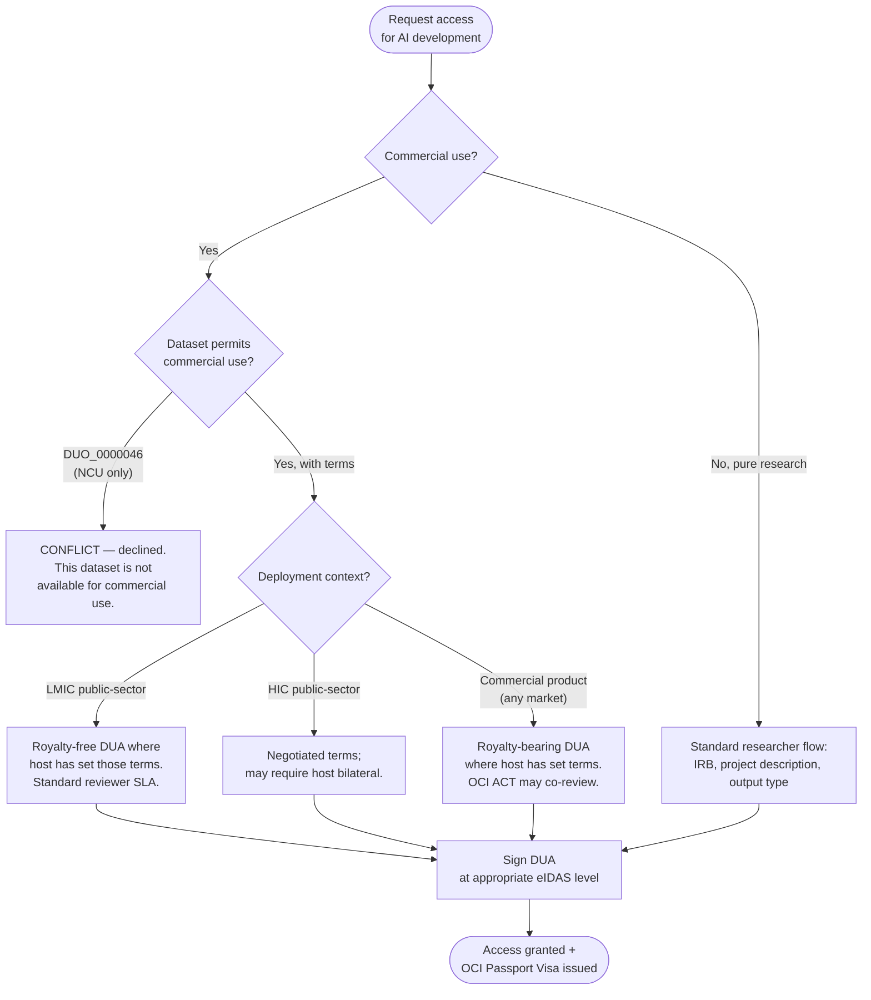

# For AI solution developers

You're building an AI product for a health problem WHO has prioritised — or one that matters in the markets you serve. You need training data you can trust, with permission terms a regulator and an investor will both accept, and an access process that doesn't assume you're a US academic research lab.

This section is for you.

## Who this audience is

You're a developer in one of these shapes:

- **An LMIC AI startup** building a deployable solution for your country's public health system (TB triage, antenatal-risk scoring, cervical-cancer screening, etc.).
- **A MedTech / IVD company** integrating an AI module into a regulated medical device or in-vitro diagnostic. Could be early-stage or established.
- **An academic spin-off** commercialising a model first developed in a research project.
- **A WHO Collaborating Centre or implementation team** running a pilot at the boundary between research and deployed product.
- **A development-finance-backed initiative** — Gates Foundation, GAVI, Wellcome Trust grantee — building public-good AI for global health.

The OCI exists in part to serve you. The platform's distinctive mandate under GI-AI4H ([ITU-WHO-WIPO Global Initiative on AI for Health](https://aiforgood.itu.int/event/data-standards-for-health-ai-benchmarking-metadata-and-federated-data-discovery/)) is to **enable AI solutions for WHO public-health priorities, especially in low- and middle-income countries (LMICs)** — and that work is largely done by commercial actors like you.

## What you get from the OCI

- **Curated, GI-AI4H-vetted datasets** aligned to WHO health priorities. Not every dataset on every random platform — datasets we actively want AI builders to use for those priorities.
- **Clear permission terms up-front.** Each dataset declares whether commercial use is allowed and on what terms (royalty-free for LMIC public-sector deployment, royalty-bearing for HIC commercial deployment, etc.) — using machine-readable [GA4GH DUO](https://www.ga4gh.org/product/data-use-ontology-duo/) codes plus structured commercial-terms metadata. You know ex-ante whether your use case fits.
- **A path through access governance that respects your situation.** The request form asks the questions that matter to you (deployment country, regulatory pathway, WHO-priority alignment, royalty obligations) — not just "what's your IRB approval reference".
- **Reproducible dataset versioning.** Cite the exact manifest hash you trained on. Critical for FDA / EMA / Anvisa / national-MoH submissions years later.
- **Federation with peer archives.** A researcher cleared at EGA arrives with their GA4GH Passport; their identity work travels to OCI. The same will be true in the other direction once we issue our own Visas.

## What you don't get

- **Not all datasets in the catalogue are commercial-use OK.** Hosts who tagged their dataset with `DUO_0000046` (Non-Commercial Use Only) or `DUO_0000045` (Not-for-profit non-commercial only) have restricted to research-only. The matcher will return CONFLICT for commercial requests on those — no point trying to talk your way around it.
- **Not a free pass on regulatory work.** OCI gives you better data and better terms; you still owe the regulator your validation, your bias analyses, your post-market surveillance. The OCI's evaluation surface (Phase C) helps you produce them, but doesn't substitute for them.
- **Not a substitute for ethics review.** If your use case requires IRB approval (most clinical-data uses do), the platform records the approval reference and machine-checks the fact of it; the substantive review remains with your IRB.
- **Not a marketplace.** OCI is not Hugging Face, Kaggle, or AWS Data Exchange. There's no payment rail; royalty terms (where applicable) are bilateral with the dataset host.

## Where to start

| Guide                                                                      | Read when                                                                                              |
| -------------------------------------------------------------------------- | ------------------------------------------------------------------------------------------------------ |
| [How access works (overview)](../overview/access-governance.md)            | First time. Plain-English explainer of identity tiers, DUO, DUA, e-signatures, GA4GH Passports.        |
| [Requesting access for commercial / deployment use](./accessing-data.md)   | You've found a dataset and need to file a request that covers your commercial deployment scenario.     |
| Choosing a dataset for AI development _(coming with Phase 1)_              | You're scoping a project and need to filter by WHO priority, deployment region, commercial-use status. |
| Citation & traceability for regulatory submissions _(coming with Phase C)_ | You're preparing an FDA / EMA / national-MoH submission and need stable dataset references.            |

## Quick orientation

- **PUBLIC datasets** are listed and (where the host has uploaded files) downloadable. Many GI-AI4H curated datasets sit here under permissive commercial-OK terms.
- **RESTRICTED datasets** require an access request before download. The form for AI-builder requests includes deployment-country, regulatory-pathway, and royalty-terms fields above and beyond the standard researcher form.
- **PRIVATE datasets** are invisible to you; only the host and admins see them. Drafts.

The catalogue can be filtered by:

- **WHO priority area** (TB, malaria, maternal/child health, NCDs, mental health, etc.).
- **Geographic origin** of the data (the populations it represents).
- **Commercial-use status** (`commercial OK` / `non-commercial only` / `case-by-case`).
- **Regulatory pathway-readiness** (e.g. has the dataset been used in a regulator-accepted submission before).

## What you'll need

- **An OCI account.** Today, accounts are provisioned via your country's GI-AI4H contact or via direct WHO/ITU programme onboarding. Self-service signup is on the roadmap.
- **Company / organisation details.** Your legal entity, registration jurisdiction, primary contact.
- **Any accreditation or programme membership you hold** (national MoH digital-health innovation track, multilateral-backed initiative, development-finance grant) — declare it on the request form as supporting evidence. Hosts weigh it during review. Today there's no scheme the OCI Platform has agreed with any external body to translate accreditation into automatic dataset access; if/when one emerges, declaring it now positions you for it.
- **Your project's regulatory plan.** Even a draft. Reviewers want to see that you've thought about it.
- **Your deployment plan, by country / health-system.** The DUA template will lock terms based on this.

## How the access flow differs from the researcher flow

You'll see the same request form skeleton, but with extra fields that route your request appropriately:

Three things make this AI-builder flow distinct from the researcher flow:

1. **Deployment country / region is a first-class field.** The DUA template branches on it — LMIC public-sector deployment can carry royalty-free clauses where the host has set those terms.
2. **WHO-priority alignment is asked.** Not as a gate (you don't need to be on a WHO priority list to request access), but as a routing signal — accredited WHO-priority work gets a faster path through OCI ACT for high-sensitivity datasets.
3. **The DUA template you sign is different.** Researcher DUAs assume publication-as-output. Builder DUAs assume product-as-output, with the regulatory pathway and post-market obligations baked in.

## Where to ask

- **Your country's GI-AI4H contact.** Each member-state programme has a focal point.
- **Email**: `oci-platform@itu.int` _(TODO confirm operator address)_.
- **WHO Innovation Hub / WHO programme offices**: for guidance on aligning your work with WHO health priorities. Note: as of 2026-05, the OCI Platform team has not engaged any WHO programme office as an accrediting body for dataset access — there's no pre-grant pathway you can rely on today.

## What's in scope here vs elsewhere

- Requesting access, downloading data, building your model, citing the version: this section.
- Becoming a _host_ of your own dataset: see [for-hosts/](../for-hosts/).
- Submitting your model for benchmarking: see [for-developers/](../for-developers/) (and Phase C documentation, when published).
- Pure-academic research access: see [for-researchers/](../for-researchers/).
