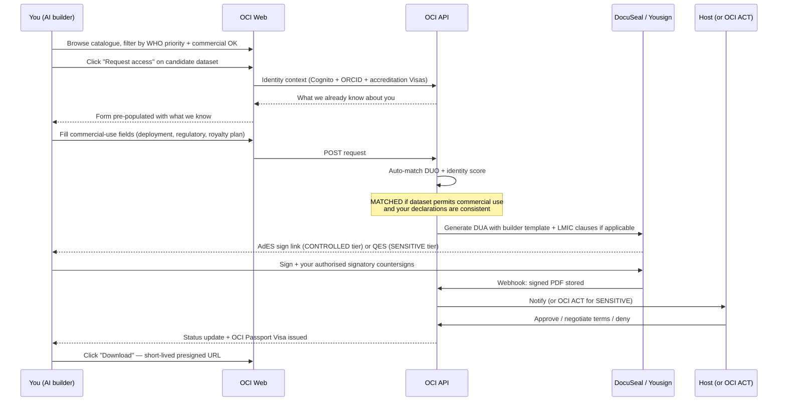

# Requesting access for commercial / deployment use

When you're building an AI product — for an LMIC public-health system, a regulated medical device, an in-vitro diagnostic — the access request you file on the OCI carries different weight than a researcher's request. The reviewer needs to see that you've thought about deployment, regulatory pathway, post-market obligations, and the terms under which you'll use the data downstream.

This guide is the practical "how to file a request that gets approved" walkthrough.

> **Status (2026-05-09)**: the builder-form variant is **live** (#120). Pick `Commercial research` or `Clinical care` under "Intended use" on `/catalog/<slug>/request-access` and the form swaps to the structured builder fields below. The `Commercial use` filter on `/catalog` (#119) lets you pre-screen for `commercial OK` datasets.
>
> Read [How access works (overview)](../overview/access-governance.md) first if you haven't yet — it explains the identity tiers, DUO, DUA, and eIDAS e-signature levels in plain English.

## Before you start — does this dataset allow commercial use?

The OCI catalogue tags every dataset with [GA4GH DUO](https://www.ga4gh.org/product/data-use-ontology-duo/) permission codes. The two that matter most for you:

- **`DUO_0000046` — Non-Commercial Use Only.** Hard stop. The matcher returns CONFLICT for any commercial request. Don't waste your time filing.
- **`DUO_0000045` — Not-for-profit, non-commercial use only.** For-profit commercial entities get CONFLICT. Not-for-profit organisations get UNCLEAR for host review (you'll need to demonstrate the not-for-profit status).

**Datasets without those codes** typically allow commercial use, subject to the terms in the host's DUA. **GI-AI4H curated datasets** are deliberately tagged to support commercial use by AI builders working on WHO priorities.

The dataset detail page surfaces this prominently: look for the **Commercial use** badge near the top — `commercial OK`, `non-commercial only`, or `case-by-case`.

## What the request form asks beyond the researcher fields

The researcher form covers project title, description, IRB approval reference, output type, retention. You'll see those — they still matter. The AI-builder form adds:

| Field                                     | What it's for                                                                                                                                                | What "good" looks like                                                                                                                                  |
| ----------------------------------------- | ------------------------------------------------------------------------------------------------------------------------------------------------------------ | ------------------------------------------------------------------------------------------------------------------------------------------------------- |
| **Legal entity**                          | Who actually signs the DUA. Must be a registered company, foundation, or accredited organisation.                                                            | "Acme Medical AI SAS, registered in France, SIREN 123456789"                                                                                            |
| **Deployment country / region**           | The DUA template branches on this. LMIC public-sector deployment may unlock royalty-free clauses.                                                            | "Senegal (primary), Mali, Burkina Faso (secondary). Public-sector deployment via Senegalese Ministry of Health."                                        |
| **Regulatory pathway**                    | What regulator you're targeting and what class of submission. Tells the reviewer how the dataset will be used in your validation evidence.                   | "EU MDR Class IIa SaMD, FDA 510(k) De Novo, WHO Prequalification stream"                                                                                |
| **WHO health-priority alignment**         | Free-text + reference to a WHO-published priority list where applicable. Routes accredited cases for faster review.                                          | "Tuberculosis triage in primary care — aligns with WHO End TB Strategy and the 2024 WHO Operational Handbook on Tuberculosis Module 2 (screening)."     |
| **Accreditation or programme membership** | Free-text. Any accreditation, programme membership, or grant you hold that's relevant — host reviewers weigh this manually; today there's no automatic gate. | "National MoH digital-health innovation programme, Senegal, accredited 2024. Reference: [URL/doc]."                                                     |
| **Royalty / commercialisation plan**      | Where the host has set commercial-use terms, what you're agreeing to.                                                                                        | "Royalty-free for Senegal MoH deployment via WHO Country Office. Subsequent commercialisation in HIC markets subject to bilateral agreement with host." |
| **Post-market data flow**                 | What you'll do with downstream data (model improvements, surveillance reports).                                                                              | "Annual technical surveillance report to host institution; aggregate model performance shared back to the host."                                        |

These declarations flow into the DUA template the host's e-signature service generates. You sign what you declared. Misalignment between declaration and intended use is contract violation, not just a paperwork mismatch.

## The flow

## Identity tiers and what they mean for you

The OCI's identity tier model (described in [overview/access-governance.md](../overview/access-governance.md)) was originally Synapse's; we adapted it. As an AI builder you'll typically need to reach **CONTROLLED** or **SENSITIVE** tier.

- **REGISTERED** — verified institutional or company email. Enough for OPEN-tier datasets.
- **CONTROLLED** — passed the certification quiz + your authorised company signatory has countersigned the DUA. This is where most commercial requests for AI development land.
- **SENSITIVE** — adds Qualified Electronic Signature (QES) on the DUA. Required when the dataset carries patient-level identifying or quasi-identifying data and the host's jurisdiction (typically EU) demands QES.

If you hold an accreditation from a recognised programme (a national MoH digital-health innovation track, a development-finance-backed initiative, or similar), declare it. Host reviewers weigh it as evidence. The OCI **does not** currently translate any third-party accreditation into an automatic identity-tier bump — no accrediting body has yet been engaged to issue Passport-shaped credentials, and we don't want to claim what isn't there. If/when such a scheme materialises, this will become an automated path; today it's a free-text signal.

## The DUA you'll sign — what's in it

The OCI generates the DUA from a template parameterised by the dataset's terms and your declarations. The AI-builder template differs from the researcher template in:

- **Use definition** is product / service development, validation, deployment — not "research with publication".
- **Regulatory pathway** clauses bind you to the submission class you declared (e.g. Class IIa SaMD post-market obligations).
- **Royalty terms** match what the host pre-declared:
  - LMIC public-sector deployment → typically royalty-free where the host has set those terms.
  - HIC commercial deployment → typically royalty-bearing or subject to bilateral negotiation.
  - Cross-licensing for derived models → host's preference, surfaced in the DUA.
- **Post-market data flow** clauses bind you to share aggregate model performance back to the host.
- **Termination** clauses cover what happens to data, models, and deployments if the dataset is withdrawn or your access is revoked.

The DUA is a real legal document. It is **not** a research project description. Have your company counsel review it before you sign — this is a normal step, not a delay.

## E-signature levels — what you'll do

| Tier                  | What you sign with                         | Practical experience                                                                                                                                                                                              |
| --------------------- | ------------------------------------------ | ----------------------------------------------------------------------------------------------------------------------------------------------------------------------------------------------------------------- |
| **OPEN / REGISTERED** | Click-wrap acceptance                      | A checkbox in the platform. Hashed and stored as legal evidence.                                                                                                                                                  |
| **CONTROLLED**        | AdES via DocuSeal (self-hosted by OCI)     | An emailed signing link. Identity-verified, tamper-evident. Free to you.                                                                                                                                          |
| **SENSITIVE**         | QES via Yousign (EU QTSP, AWS Marketplace) | An emailed signing link with stronger identity verification (typically video ID-check or eID card). Equivalent to a handwritten signature under EU law. ~€1–2 per signature, billed to the platform — not to you. |

You don't pay for any of this; the platform absorbs the signing cost as part of operating costs. See [for-strategy/access-governance-positioning.md](../for-strategy/access-governance-positioning.md#cost-shape) for why the cost shape is sustainable for a public-good platform.

## After approval

- **Download** distributions through the dataset detail page. Each download is logged with your identity, the dataset version hash, and a timestamp — this is your **chain-of-custody evidence** for the regulator. Keep these references in your training-data manifest.
- **Cite the version hash** in your model card, your regulatory submission, and your published validation evidence. The OCI's manifest hash is stable across years; your reviewer can verify it.
- **Honour the DUA you signed.** If your project pivots — different deployment country, different regulatory class, different commercial terms — file a new request rather than working under stale terms. The OCI's annual renewal cron will prompt you anyway, but don't wait for the prompt if you've materially changed direction.
- **Share post-market signal.** Where the DUA requires it, file your annual technical surveillance / model-performance report with the host. This is what closes the loop for the next builder.

## Common situations

### "We're an LMIC startup deploying through the public health system"

This is one of the cleanest paths. Declare:

- Deployment country / region with the public-sector entity named.
- WHO-priority alignment — the operational handbook or strategy document your work aligns to.
- Any accreditation or programme membership you hold (national MoH innovation track, multilateral-backed initiative, etc.) — host reviewers weigh this manually as supporting evidence.

The DUA generated for you will typically carry a royalty-free clause for that public-sector deployment, where the host has set those terms. Subsequent expansion to high-income markets is a separate negotiation — and that's a good thing, it protects you from inadvertently committing to terms you didn't read.

### "We're a MedTech company integrating an AI module"

You're a more typical commercial requester. Declare:

- The regulatory class and pathway clearly (FDA 510(k) / De Novo / EU MDR Class / national equivalent).
- Your full deployment-market list — the DUA may differentiate terms by market.
- Your post-market surveillance plan.

You'll typically reach **CONTROLLED** tier. The DUA you sign is a commercial agreement; have counsel review it. Royalty terms are typically bilateral with the host — the OCI surfaces the host's published pricing if any, but you may end up in direct negotiation for non-standard markets.

### "We're commercialising a model from an academic research project"

You're crossing the boundary from research to product. The dataset you trained on for your research may have been under a non-commercial DUA — that doesn't transfer to your commercial use. Re-request access **as a commercial entity** before deploying. The OCI flags this in the request form: "Are you re-requesting access to a dataset previously accessed under a non-commercial DUA?" — if yes, the host is alerted to confirm commercial terms.

### "We're a development-finance-backed initiative — not exactly commercial, not exactly research"

Declare your funder, your deployment plan, and your status (typically not-for-profit with commercial elements). The matcher will likely return UNCLEAR; the host reviews. The OCI ACT can help clarify edge cases for GI-AI4H curated datasets.

## What to do if your request is declined

Three patterns:

- **CONFLICT — `DUO_0000046` (Non-Commercial Use Only).** No appeal possible. The dataset is not for commercial use. Find a different dataset.
- **CONFLICT — your declarations don't match the dataset's terms.** Read the host's note carefully. If you misclassified your use case, re-file with a tighter declaration. If you fundamentally don't fit the host's terms, find a different dataset.
- **DENIED at host review.** The host has discretion above the matcher. Read the decision note. If the host wants additional information (regulatory documentation, post-market commitments, accreditation), provide it and re-file.

## Where to get help

- **Your country's GI-AI4H contact** can navigate accreditation and country-specific routing.
- **WHO health-priority materials** — published strategies and operational handbooks help you frame the alignment of your work with global priorities. (The OCI Platform team has not engaged any specific accreditation programme as a gate to dataset access; declare what you have, the host will weigh it.)
- **The dataset host** for dataset-specific questions about terms.
- **`oci-platform@itu.int`** for platform questions _(TODO confirm operator address)_.
- **OCI ACT** for SENSITIVE-tier and curated-dataset escalations.

## Feedback

The AI-builder access flow is new. If something doesn't fit your situation — your deployment context, your regulatory pathway, your accreditation — tell us. The form, the DUA template, and the routing rules are configurable; what's missing today can land in next month's release. File issues at [`FG-AI4H/oci-platform`](https://github.com/FG-AI4H/oci-platform/issues).
