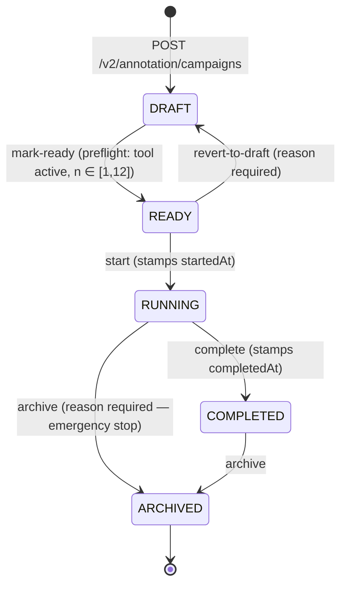
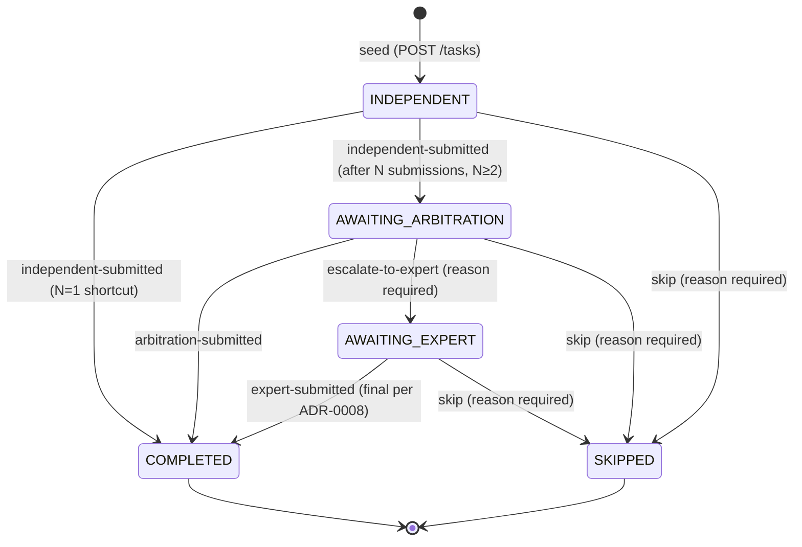

# Annotation module

Architecture reference for the OCI annotation track. Use this as the developer entry point when navigating `apps/api/src/modules/annotation/` and `apps/web/src/app/annotation/`.

ADR linkage: [ADR-0006](../adr/0006-annotation-integration-hub-orchestrator.md), [ADR-0007](../adr/0007-annotation-tool-integration-contract.md), [ADR-0008](../adr/0008-annotation-persistence-and-provenance.md), [ADR-0009](../adr/0009-annotation-task-assignment-and-multi-rater-policy.md), [ADR-0010](../adr/0010-annotation-metadata-exposure-and-blinding.md), [ADR-0011](../adr/0011-annotation-sample-rejection.md), [ADR-0012](../adr/0012-annotation-rights-licensing-annotator-agreement.md).

## Campaign lifecycle state machine (#215, slice 1)

A campaign moves through five states. The state machine is enforced server-side in `apps/api/src/modules/annotation/campaign-state-machine.ts`; the web side reads `availableCampaignActions()` / `campaignActionRequiresReason()` from `@oci/shared-types` to drive button visibility and reason prompts.

### Allowed actions per state

| From state | Action            | To state  | Reason required | Stamps                | Notes                                        |
| ---------- | ----------------- | --------- | --------------- | --------------------- | -------------------------------------------- |
| DRAFT      | `mark-ready`      | READY     | no              | —                     | Runs the preflight (active tool, n in range) |
| READY      | `revert-to-draft` | DRAFT     | yes             | —                     | Manager mistake recovery                     |
| READY      | `start`           | RUNNING   | no              | `startedAt = now()`   | Slice 2 also generates initial tasks here    |
| RUNNING    | `complete`        | COMPLETED | no              | `completedAt = now()` | Slice 2 enforces "no in-flight tasks" first  |
| RUNNING    | `archive`         | ARCHIVED  | yes             | —                     | Emergency stop; cancels tasks in slice 2     |
| COMPLETED  | `archive`         | ARCHIVED  | no              | —                     | Normal tidy-up of finished work              |
| ARCHIVED   | _none_            | —         | —               | —                     | Terminal — clone the campaign to revive      |

### HTTP surface

| Method | Path                                         | Auth               | Purpose                                                                        |
| ------ | -------------------------------------------- | ------------------ | ------------------------------------------------------------------------------ |
| GET    | `/v2/annotation/campaigns`                   | authenticated      | List recent campaigns                                                          |
| GET    | `/v2/annotation/campaigns/:slug`             | authenticated      | Detail (includes `startedAt` / `completedAt`)                                  |
| POST   | `/v2/annotation/campaigns`                   | `campaign-manager` | Create a DRAFT                                                                 |
| POST   | `/v2/annotation/campaigns/:slug/transitions` | `campaign-manager` | Drive the lifecycle. Body: `{ action, reason? }`. Reason validated server-side |
| GET    | `/v2/annotation/tool-integrations`           | authenticated      | Read the stub tool-integration registry                                        |

### Persistence

- `annotation.annotation_campaigns.status` carries the current state (Postgres enum).
- `started_at` is set on the first `start` transition and never reset.
- `completed_at` is set on the first `complete` transition.
- A dedicated transition-history table arrives in slice 2 of #215 (alongside the task model). For slice 1 the only audit signal is the structured pino log line emitted by `CampaignService.transition`.

## Task workflow + 3-gate SOP (#215, slice 2)

A campaign breaks down into `AnnotationTask` rows (one per sample). Each task carries a `gateState` that progresses through the ITU-T FG-AI4H DEL05-A03 3-gate SOP. Slice 2 implements the state machine + the FIFO + role-Visa-scope routing from ADR-0009 Decision 1; experience-weighted ranking, bias-prevention sampling, stratification, and the calibration loop are slice 3.

### Allowed gate transitions

| From gate            | Action                  | To                   | Reason required | Notes                                                                                  |
| -------------------- | ----------------------- | -------------------- | --------------- | -------------------------------------------------------------------------------------- |
| INDEPENDENT          | `independent-submitted` | AWAITING_ARBITRATION | no              | When `nAnnotatorsRequired ≥ 2`. Fires after the Nth submission lands at this gate.     |
| INDEPENDENT          | `independent-submitted` | COMPLETED            | no              | When `nAnnotatorsRequired = 1`. Single-rater shortcut per ADR-0009 Decision 2.         |
| INDEPENDENT          | `skip`                  | SKIPPED              | yes             | Operator override; stamps `completedAt`                                                |
| AWAITING_ARBITRATION | `arbitration-submitted` | COMPLETED            | no              | One arbitration submission ends the task                                               |
| AWAITING_ARBITRATION | `escalate-to-expert`    | AWAITING_EXPERT      | yes             | Arbitration could not resolve; reason captured for audit                               |
| AWAITING_ARBITRATION | `skip`                  | SKIPPED              | yes             | Operator override                                                                      |
| AWAITING_EXPERT      | `expert-submitted`      | COMPLETED            | no              | Final per ADR-0008 (no path back to arbitration)                                       |
| AWAITING_EXPERT      | `skip`                  | SKIPPED              | yes             | Operator override                                                                      |
| COMPLETED / SKIPPED  | _none_                  | —                    | —               | Terminal — re-open is intentionally out of scope. Clone the campaign or file a reject. |

### Routing (slice 2 cut)

The router (`TaskService.pullNext`) applies the predicate chain from ADR-0009 Decision 1, simplified for slice 2:

1. **Role-Visa scope (predicate 1)** — the caller's Cognito group maps to the gate they're eligible for: `annotator` → INDEPENDENT, `arbitration-annotator` → AWAITING_ARBITRATION, `expert-reviewer` → AWAITING_EXPERT. Multi-role callers receive the earliest gate they qualify for (preserves SOP ordering).
2. **(deferred — slice 3+)** Capability match, experience-weighted ranking, bias-prevention sampling, class-balance / stratification check, calibration-loop bookkeeping.
3. **FIFO tiebreaker (predicate 6)** — earliest `createdAt` task whose gate matches and where the caller doesn't already hold an assignment.

In-flight assignments are re-issued idempotently — a reload of the annotator UI doesn't double-count work.

### HTTP surface

| Method | Path                                         | Auth                                                      | Purpose                                                |
| ------ | -------------------------------------------- | --------------------------------------------------------- | ------------------------------------------------------ |
| POST   | `/v2/annotation/campaigns/:slug/tasks`       | `campaign-manager`                                        | Seed tasks from a list of `sampleRefs` (idempotent)    |
| GET    | `/v2/annotation/campaigns/:slug/tasks`       | `campaign-manager` / `task-supervisor`                    | List campaign tasks for the manager dashboard          |
| POST   | `/v2/annotation/campaigns/:slug/tasks/next`  | `annotator` / `arbitration-annotator` / `expert-reviewer` | Pull the caller's next eligible task (router)          |
| POST   | `/v2/annotation/assignments/:id/submissions` | same as above                                             | Submit annotation; gate advances per the state machine |

### Persistence

- `annotation.annotation_tasks` — gate pointer + nAnnotators snapshot + completion timestamp.
- `annotation.annotation_task_assignments` — per-annotator handoff lifecycle. The unique partial index `(task, user, gate) WHERE status IN ('PENDING','IN_PROGRESS')` prevents double-booking while leaving SUBMITTED + EXPIRED rows historical.
- Submission payload is stored verbatim in the assignment row. Tool-integration-aware schema validation per ADR-0007 lands with #214 / #231.

## What lands next

Per #215, the remaining slices:

- **Slice 3** — ADR-0009 routing predicates 2–5 (capability, experience ranking, bias-prevention, stratification) + decision-box predicates at gate-1 (IRR-pass = skip arbitration) + per-task-type fusion (STAPLE for segmentation, majority-vote / median otherwise).
- **Web slice** — annotator queue UI, gate progression visualisation, supervisor inbox.
- **Audit emission** — task lifecycle events into `@oci/audit` once the per-task taxonomy lands (slice 3+).

The campaign lifecycle + task state machine (this doc) are the preconditions for all three.
