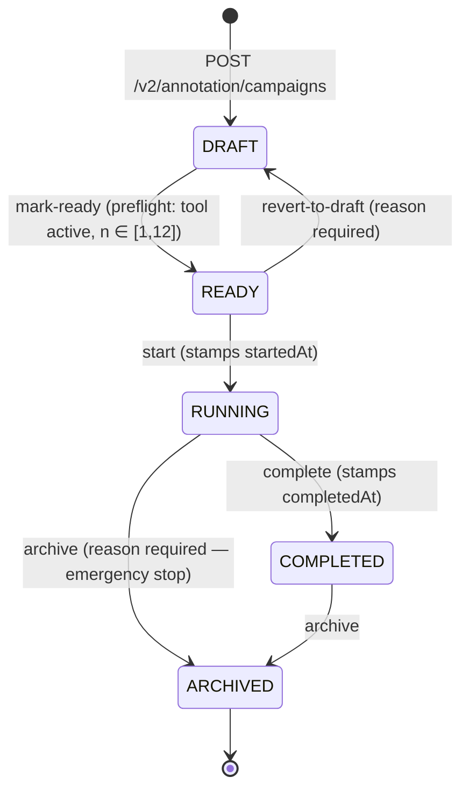

# Annotation module

Architecture reference for the OCI annotation track. Use this as the developer entry point when navigating `apps/api/src/modules/annotation/` and `apps/web/src/app/annotation/`.

ADR linkage: [ADR-0006](../adr/0006-annotation-integration-hub-orchestrator.md), [ADR-0007](../adr/0007-annotation-tool-integration-contract.md), [ADR-0008](../adr/0008-annotation-persistence-and-provenance.md), [ADR-0009](../adr/0009-annotation-task-assignment-and-multi-rater-policy.md), [ADR-0010](../adr/0010-annotation-metadata-exposure-and-blinding.md), [ADR-0011](../adr/0011-annotation-sample-rejection.md), [ADR-0012](../adr/0012-annotation-rights-licensing-annotator-agreement.md).

## Campaign lifecycle state machine (#215, slice 1)

A campaign moves through five states. The state machine is enforced server-side in `apps/api/src/modules/annotation/campaign-state-machine.ts`; the web side reads `availableCampaignActions()` / `campaignActionRequiresReason()` from `@oci/shared-types` to drive button visibility and reason prompts.

### Allowed actions per state

| From state | Action            | To state  | Reason required | Stamps                | Notes                                        |
| ---------- | ----------------- | --------- | --------------- | --------------------- | -------------------------------------------- |
| DRAFT      | `mark-ready`      | READY     | no              | —                     | Runs the preflight (active tool, n in range) |
| READY      | `revert-to-draft` | DRAFT     | yes             | —                     | Manager mistake recovery                     |
| READY      | `start`           | RUNNING   | no              | `startedAt = now()`   | Slice 2 also generates initial tasks here    |
| RUNNING    | `complete`        | COMPLETED | no              | `completedAt = now()` | Slice 2 enforces "no in-flight tasks" first  |
| RUNNING    | `archive`         | ARCHIVED  | yes             | —                     | Emergency stop; cancels tasks in slice 2     |
| COMPLETED  | `archive`         | ARCHIVED  | no              | —                     | Normal tidy-up of finished work              |
| ARCHIVED   | _none_            | —         | —               | —                     | Terminal — clone the campaign to revive      |

### HTTP surface

| Method | Path                                         | Auth               | Purpose                                                                        |
| ------ | -------------------------------------------- | ------------------ | ------------------------------------------------------------------------------ |
| GET    | `/v2/annotation/campaigns`                   | authenticated      | List recent campaigns                                                          |
| GET    | `/v2/annotation/campaigns/:slug`             | authenticated      | Detail (includes `startedAt` / `completedAt`)                                  |
| POST   | `/v2/annotation/campaigns`                   | `campaign-manager` | Create a DRAFT                                                                 |
| POST   | `/v2/annotation/campaigns/:slug/transitions` | `campaign-manager` | Drive the lifecycle. Body: `{ action, reason? }`. Reason validated server-side |
| GET    | `/v2/annotation/tool-integrations`           | authenticated      | Read the stub tool-integration registry                                        |

### Persistence

- `annotation.annotation_campaigns.status` carries the current state (Postgres enum).
- `started_at` is set on the first `start` transition and never reset.
- `completed_at` is set on the first `complete` transition.
- A dedicated transition-history table arrives in slice 2 of #215 (alongside the task model). For slice 1 the only audit signal is the structured pino log line emitted by `CampaignService.transition`.

## What lands next

Per #215, the remaining slices in this sequence:

- **Slice 2** — Task + TaskAssignment Prisma models, `GET /v2/annotation/tasks` queue endpoint, basic round-robin routing per ADR-0009.
- **Slice 3** — Three-gate SOP from ITU-T FG-AI4H DEL05-A03 (independent → arbitration → expert review), per-task gate state machine, decision-box predicates, IRR + fusion.
- **Web slice** — annotator queue UI, gate progression visualisation, supervisor inbox.

The campaign lifecycle (this doc) is the precondition for all three.
