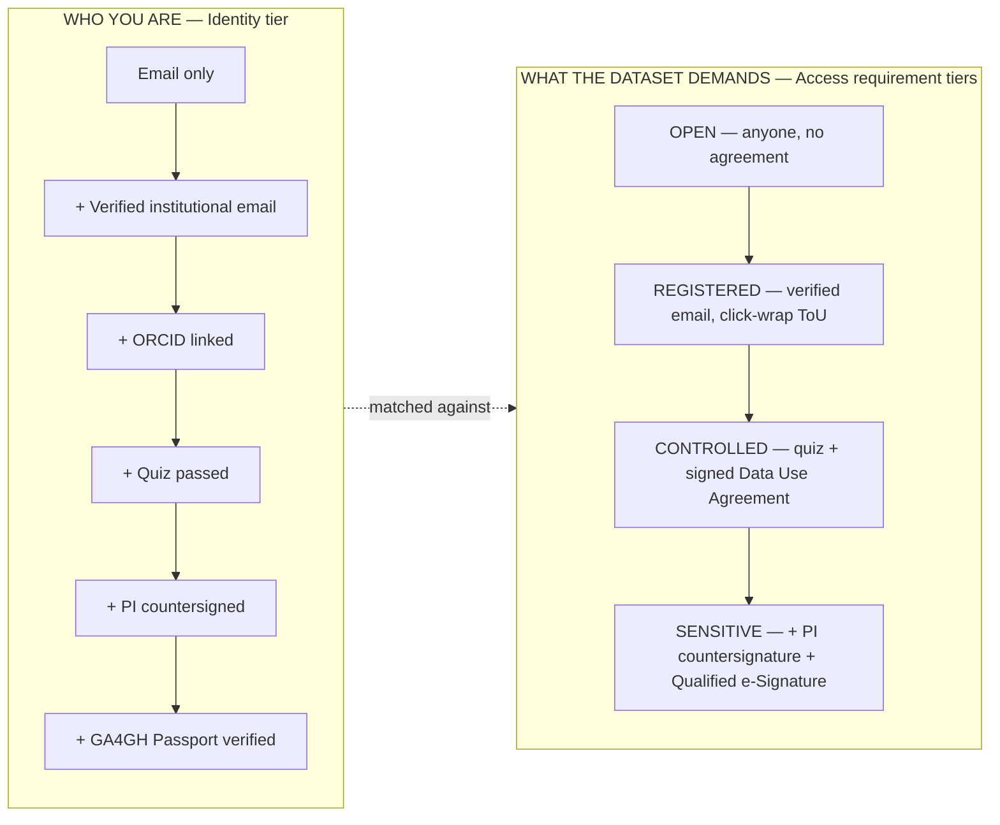
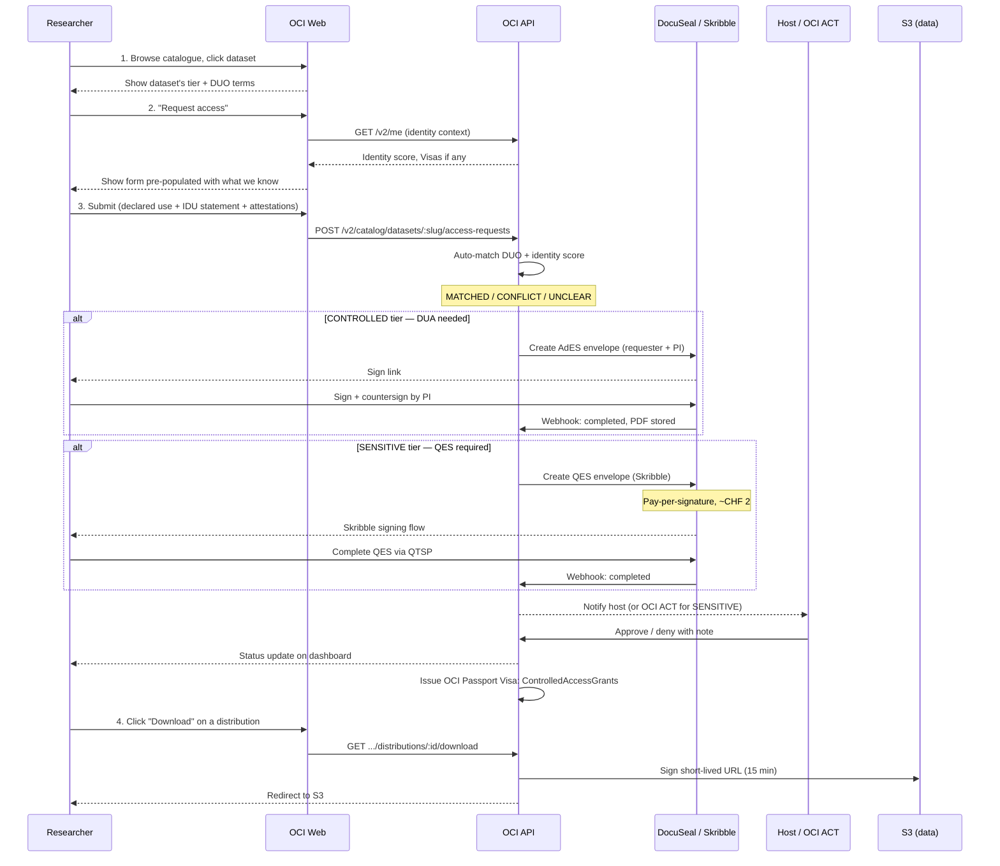
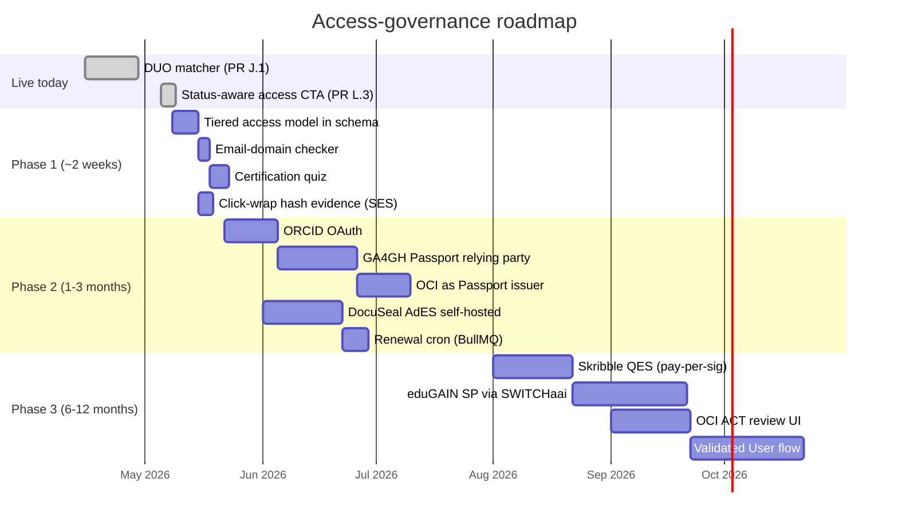

# Access governance — how OCI decides who gets data

> **One-sentence summary.** Each dataset declares two things — *how sensitive it is* (its tier) and *what permissions it grants* (its DUO terms); each requester arrives with two things — *evidence of who they are* (their identity) and *a declaration of what they intend* (their use); the platform matches the four and routes the rest to a human reviewer.

This page is the **plain-English master explainer**. Audience-specific guides (how to *request* access, how to *review* it, what the *governance policy* is) link back here. If you read one access-governance page, read this one.

For the architectural decision behind the model, see [ADR-0003](../adr/0003-tiered-identity-assurance-and-access-requirements.md). For the field research that fed the decision, see [docs/research/access-governance-2026-05-08.md](../research/access-governance-2026-05-08.md).

## The airport analogy

Think of OCI's catalogue as a building with rooms of different sensitivity. Some rooms are **open to the public** (PUBLIC datasets). Some need a **library card** (REGISTERED). Some need a **passport and a stamped visa** for that specific room (CONTROLLED). And some need both that *and* a **notarised letter from your institution** (SENSITIVE).

The library card, the passport, and the notarised letter are not the same thing — they're stacked. You don't lose the library card just because you also have a notarised letter; each one proves something different.

That's the OCI model. We call the cards/passports/letters **identity evidence**, and we call the rules each room enforces **access requirements** (ARs).

## The two axes

Two independent dimensions, mixed-and-matched per dataset:

A requester needs **enough identity evidence to satisfy what the dataset's tier demands**. A `CONTROLLED` dataset wants at least a passed quiz. A `SENSITIVE` one additionally wants a countersigning Principal Investigator and a Qualified e-Signature.

## Plain-English translation of the building blocks

### Data Use Ontology (DUO)
**What it is.** A vocabulary of ~30 standardized labels that say what a dataset is *for* (e.g. *General Research Use*, *Health/Medical/Biomedical Research*, *Disease-Specific Research*) and what extra rules apply (e.g. *Non-Commercial Use Only*, *Ethics Approval Required*, *Publication Required*). Created by GA4GH (Global Alliance for Genomics and Health), an international standards body the field has rallied around.

**Why we use it.** Two researchers and three platforms can argue forever about whether *"we want to publish a model trained on this for a non-commercial study"* is allowed under *"Non-Commercial Use Only with Ethics Approval Required"*. Express both in DUO codes (`NCU` + `IRB`) and the answer is mechanical.

**Status: live today.** The OCI catalogue auto-matches a requester's declared use against a dataset's DUO terms and labels the result **MATCHED**, **CONFLICT**, or **UNCLEAR** for the host's review. See [for-governance/duo-and-dua.md](../for-governance/duo-and-dua.md).

### Data Use Agreement (DUA)
**What it is.** The formal contract between the requester (and their institution) and the data host. Spells out: what data is being shared, what it can be used for, retention period, deletion obligations, publication rules, jurisdiction, liability, indemnification.

**Why we need one.** DUO labels say what's allowed; a DUA *binds* the requester to those rules. For most clinical / patient-level data, the host's legal department won't release bytes without one — and for some EU-jurisdiction data, the law requires it.

**Status: planned.** The OCI generates DUAs from a template parameterised by the dataset's DUO terms and the requester's intended use, then routes them through e-signature. See *Phase 2* below.

### GA4GH Passport
**What it is.** A standardised, cryptographically-signed digital credential that says *"I am Dr. So-and-so, affiliated with such-and-such institution, with these approvals already in place"*. Issued by trusted brokers like ELIXIR AAI (Europe), NIH RAS (US), and (planned) Sage Bionetworks' Synapse broker. Inside is a list of *Visas* — each Visa is a single signed claim like "is faculty at ETH Zürich" or "has been approved for dataset X".

**Why we use it.** A researcher who has *already* been vetted by EGA (the European Genome-phenome Archive) shouldn't have to re-prove they're a researcher when they come to OCI. They present their Passport, we read the signed Visas, and skip everything we already have evidence for.

**Status: planned (Phase 2).** OCI both *reads* Passports from peer brokers AND *issues* its own — so a researcher cleared at OCI is recognisable elsewhere.

### eIDAS — Simple, Advanced, Qualified e-Signatures (SES / AdES / QES)
**What they are.** EU Regulation 910/2014 ("eIDAS") defines three escalating levels of e-signature:

| Level | What it proves | When it's enough |
|---|---|---|
| **SES** — Simple Electronic Signature | Click-through with a stored hash of the agreement and timestamp. | Most click-wrap ToS; legally binding under US ESIGN/UETA today. |
| **AdES** — Advanced Electronic Signature | Identity-verified, uniquely linked to the signer, tamper-evident. | Most data-use agreements. "Presumed reliable but refutable" in EU courts. |
| **QES** — Qualified Electronic Signature | AdES + a qualified certificate from an EU-recognised Trust Service Provider (a "QTSP"). | Equivalent to a handwritten signature under EU law (Article 25). Required for some patient-data flows. |

**How OCI implements each.** SES is built-in (we hash and store the click-wrap acceptance). AdES uses **DocuSeal**, an open-source signing service self-hosted in our existing AWS Fargate cluster (no per-signature cost). QES uses **Yousign**, an EU Qualified Trust Service Provider, billed pay-per-signature through **AWS Marketplace** so the QES line consolidates onto our existing AWS account (~€1–2 per signature, no minimum). We deliberately avoided DocuSign — it's per-seat / per-month with envelope quotas, the wrong cost shape for our usage. AWS itself does not offer a first-party eIDAS signature service (AWS Signer is for code, not documents); becoming our own QTSP via KMS+CloudHSM is theoretically possible but would require ETSI EN 319 411 audit by an EU notified body — far out of scope.

### Institutional Review Board (IRB) / Ethics Approval
**What it is.** The committee at the requester's institution that approves human-subject research. Most clinical data uses require an IRB-approved protocol before access is granted; some don't (e.g. methodology studies on already-public data).

**How OCI uses it.** Datasets can declare `IRB` as a DUO modifier — meaning "you may not access this without an IRB approval". The requester self-attests + provides an approval reference; for CONTROLLED+ tiers this is later verified by the host.

### Principal Investigator (PI) / Signing Official
**What it is.** Someone other than the requester at the requester's institution — typically the PI of the project, or a designated institutional signatory — who countersigns the DUA. Synapse's docs put it bluntly: *"you cannot serve as your own signing official"*.

**Why.** It guarantees institutional accountability. If the requester misuses the data, the institution is on the hook with a contract their own signatory put their name to.

## How a request flows end-to-end

The four checkpoints: **declare → match → sign → review**. Any step can fail and bounces the request back to the requester with a clear reason.

## What's live today vs. what's coming

| Capability | Live today | Phase 1 | Phase 2 | Phase 3 |
|---|---|---|---|---|
| DUO matcher | ✅ | ✅ | ✅ | ✅ |
| Free-text justification | ✅ | replaced by structured IDU | structured IDU | structured IDU |
| Email verification | partial | ✅ + domain check | ✅ + ORCID | ✅ + Passport |
| Quiz / Certified user | — | ✅ | ✅ | ✅ |
| Click-wrap evidence (SES) | — | ✅ | ✅ | ✅ |
| Signed DUA (AdES) | — | — | ✅ via DocuSeal | ✅ |
| QES for sensitive datasets | — | — | — | ✅ via Skribble |
| GA4GH Passport — read | — | — | ✅ | ✅ |
| GA4GH Passport — issue | — | — | ✅ | ✅ |
| eduGAIN SAML SSO | — | — | — | ✅ |
| OCI ACT review queue | — | — | — | ✅ |

## Cost shape

Most existing platforms (DocuSign, Adobe Sign) charge **per seat per month with envelope quotas**, optimised for sales-ops. Our pattern is **rare and bursty across a small operator team** — wrong shape.

OCI's stack:
- **SES (most cases)** — built-in click-wrap with hash storage, **CHF 0**.
- **AdES (CONTROLLED tier DUAs)** — DocuSeal self-hosted in our existing ECS Fargate cluster, **~$15/mo Fargate task**, no SaaS bill.
- **QES (SENSITIVE tier only, when policy requires it)** — Yousign pay-per-signature via **AWS Marketplace** (EU QTSP), **~€1–2/signature, no minimum, no monthly fee**.

Indicative annual cost for QES at 100 signatures/year: **~€150**. Compare to DocuSign Standard at ~$540/seat/year, ×N operator seats, ignoring envelope overage. The QES bill flows through the existing AWS Marketplace channel — no separate vendor procurement, no second invoice line.

## What this looks like to each audience

- **A researcher** sees a familiar Synapse/EGA-style flow: sign in, request access, fill a structured intended-use form, sign a DUA if needed, get approved. They benefit when they bring a Passport from another platform — the OCI skips what they've already proved. → [for-researchers/requesting-access.md](../for-researchers/requesting-access.md)
- **An AI solution developer** (LMIC startup, MedTech vendor, academic spin-off building deployable AI for WHO health priorities) sees the same flow but with extra fields tuned to commercial / deployment use: target deployment country, regulatory pathway, public-health-priority alignment, royalty terms (where the host has set them). The DUA template they sign carries an explicit *commercial-use-permitted* mode where the dataset's terms allow it; LMIC public-sector deployments can carry royalty-free clauses that the platform records and surfaces to regulators. → [for-ai-builders/](../for-ai-builders/)
- **A dataset host** sees an inbox with auto-match badges and pre-validated identity evidence. They approve mechanical cases in one click and focus their attention on the genuinely judgement-call ones. They also choose, per-dataset, whether commercial use is permitted at all and on what terms. → [for-hosts/reviewing-access-requests.md](../for-hosts/reviewing-access-requests.md)
- **A governance reader** (regulator, member-state representative) sees a model that's GA4GH-conformant, eIDAS-compliant, GDPR-defensible, and auditable end-to-end. → [for-governance/duo-and-dua.md](../for-governance/duo-and-dua.md)
- **A strategy reader** (ITU/WHO/WIPO leadership) sees a platform that doesn't pay vendor lock-in tax, federates with the field's biggest data archives, and positions OCI as the **curated data layer enabling LMIC AI solution companies to build for WHO health priorities** — not just an academic-research catalogue. → [for-strategy/access-governance-positioning.md](../for-strategy/access-governance-positioning.md)
- **A platform developer** sees an architectural seam with a normalized identity context, a modular auth pipeline that plugs in new identity sources without changing authz logic, and clear extension points. → [ADR-0003](../adr/0003-tiered-identity-assurance-and-access-requirements.md), [for-developers/api-reference.md](../for-developers/api-reference.md)

### A note on commercial use

OCI is not a non-commercial-only catalogue. The platform is convened in part to **enable AI solutions for WHO health priorities in LMICs**, and that work is largely done by commercial actors — startups, MedTech companies, academic spin-offs. Commercial use is therefore a **first-class scenario**, not a corner case.

What the platform enforces is that commercial use happens **only on datasets whose host has explicitly granted it**. The DUO vocabulary distinguishes:

- **Commercial use OK** — datasets curated by GI-AI4H or contributed by hosts who explicitly want their data used in deployable products. The matcher returns MATCHED for commercial requesters.
- **Non-Commercial Use Only (DUO_0000046)** — datasets where the host has restricted to research-only. The matcher returns CONFLICT for commercial requesters.
- **Not-for-profit non-commercial only (DUO_0000045)** — narrower; for-profit commercial entities get CONFLICT, not-for-profits get UNCLEAR for host review.

A commercial requester is required to declare:
- Their **intended deployment country / region** (LMIC public-sector deployment may unlock royalty-free clauses).
- Their **regulatory pathway** (medical device, software-as-a-medical-device class, in-vitro diagnostic, advisory tool).
- Their **WHO health-priority alignment** (free-text + reference to a WHO-published priority list where applicable).
- Whether they are **registered with the WHO Innovation Hub** or accredited by a national MoH innovation programme — these can pre-grant access to GI-AI4H curated datasets via OCI's identity tier system.

These declarations live alongside (not instead of) the standard IRB / institutional / DUO checks. A WHO-priority-aligned LMIC startup gets a smoother path; a commercial actor with no clear public-health alignment gets the same scrutiny as a high-risk research request.

## Why this design — the executive 60 seconds

1. **Mirror what works.** Synapse (our partner) has run this two-axis tiered-AR model for over a decade with hundreds of regulated datasets. We're not inventing — we're adopting and re-implementing in our stack.
2. **Federate from day one.** GA4GH Passports as both a relying-party and an issuer mean OCI is a peer to EGA / dbGaP / Synapse, not an island. A researcher's identity work travels.
3. **Cost scales with usage, not team size.** Pay-per-signature for QES, self-hosted for AdES, built-in click-wrap for SES. The platform doesn't pay a per-seat tax to operate.
4. **Don't break legacy.** Existing access-requests carry forward as `EMAIL_ONLY` identity tier. Existing host workflows keep working. New evidence types stack on rather than replace.
5. **Standards-aligned, not standards-locked.** GA4GH for federation, eIDAS for signatures, DUO for permissions, ORCID for affiliation. If the field adopts something better (W3C Verifiable Credentials, EUDI Wallet) we add a translator — we don't restart.

## Glossary cheat-sheet

| Acronym | Long form | What it does in OCI |
|---|---|---|
| **AAI** | Authentication & Authorization Infrastructure | The auth-brokering tier (e.g. ELIXIR AAI in Europe). |
| **ACT** | Access & Compliance Team | The Synapse term for the platform-level review committee. OCI's equivalent is the GI-AI4H Access & Compliance Team — an ITU/WHO-appointed body for SENSITIVE tier reviews. |
| **AdES** | Advanced Electronic Signature | eIDAS middle tier. Identity-verified, tamper-evident. |
| **AR** | Access Requirement | What a dataset's tier demands of a requester. |
| **DAC** | Data Access Committee | The body that decides per-dataset access. In OCI, the host. For SENSITIVE, OCI ACT may co-review. |
| **DTUA / DUA** | Data Transfer & Use Agreement | The contract between requester (+ their institution) and the host. |
| **DUO** | Data Use Ontology | The GA4GH vocabulary for dataset permissions and requester intent. |
| **eIDAS** | Electronic Identification, Authentication and trust Services | EU Regulation 910/2014, defines SES/AdES/QES. |
| **GA4GH** | Global Alliance for Genomics and Health | International standards body. Authors of DUO + Passports. |
| **IDU** | Intent to Use (statement) | Structured replacement for free-text "justification". |
| **IRB** | Institutional Review Board | Ethics committee. |
| **JWKS** | JSON Web Key Set | The public-keys endpoint the platform exposes for Visa verification. |
| **ORCID** | Open Researcher and Contributor ID | Persistent scholarly identifier. We OAuth against orcid.org. |
| **Passport** | GA4GH Passport | Bundle of signed Visas attesting to a researcher's status / approvals. |
| **PI** | Principal Investigator | The institutional signatory who countersigns the DUA. |
| **QES** | Qualified Electronic Signature | eIDAS top tier. Equivalent to handwriting under EU law. |
| **QTSP** | Qualified Trust Service Provider | EU-recognised entity authorised to issue QES (e.g. Swisscom, Skribble). |
| **REFEDS R&S** | Research and Scholarship category | An eduGAIN attribute bundle for academic SSO. |
| **SES** | Simple Electronic Signature | eIDAS bottom tier. Click-wrap with hash storage. |
| **SO** | Signing Official | Institutional signatory (= PI in most cases). |
| **Visa** | GA4GH Visa | A single signed claim inside a Passport. |
| **ZertES** | Swiss equivalent of eIDAS | Swiss federal e-signature law. Skribble conforms to both. |

## Further reading

- The architectural decision: [ADR-0003](../adr/0003-tiered-identity-assurance-and-access-requirements.md)
- The field-research write-up that fed it: [docs/research/access-governance-2026-05-08.md](../research/access-governance-2026-05-08.md)
- GA4GH Passport spec: https://ga4gh.github.io/data-security/ga4gh-passport
- GA4GH DUO product: https://www.ga4gh.org/product/data-use-ontology-duo/
- Synapse User Account Tiers: https://help.synapse.org/docs/User-Account-Tiers.2007072795.html
- eIDAS Regulation 910/2014 (EU Commission): https://digital-strategy.ec.europa.eu/en/policies/eidas-regulation
